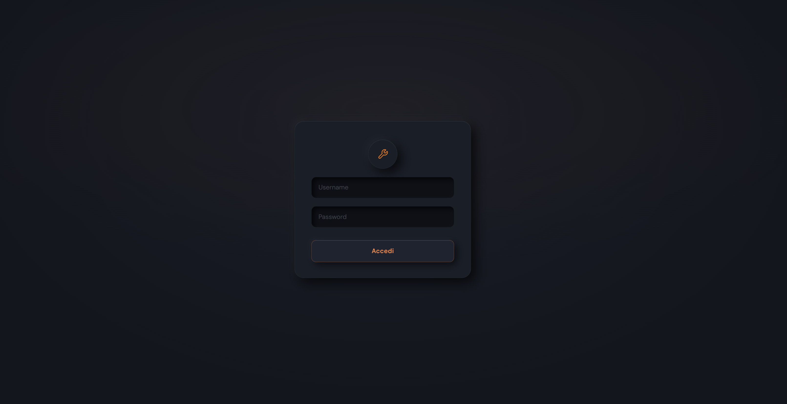
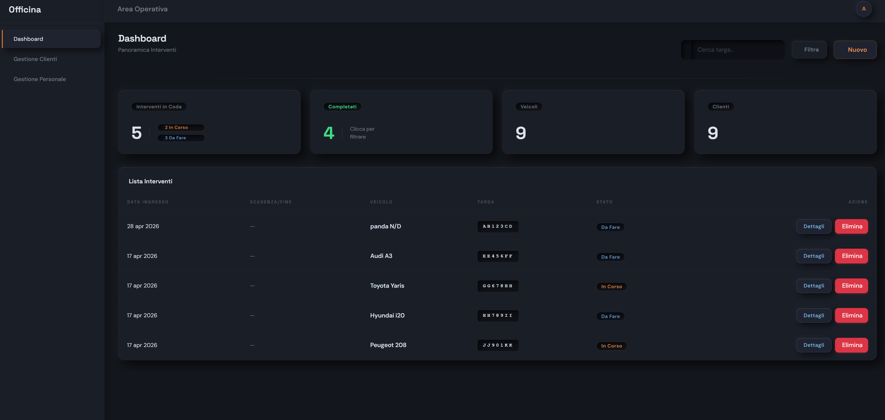
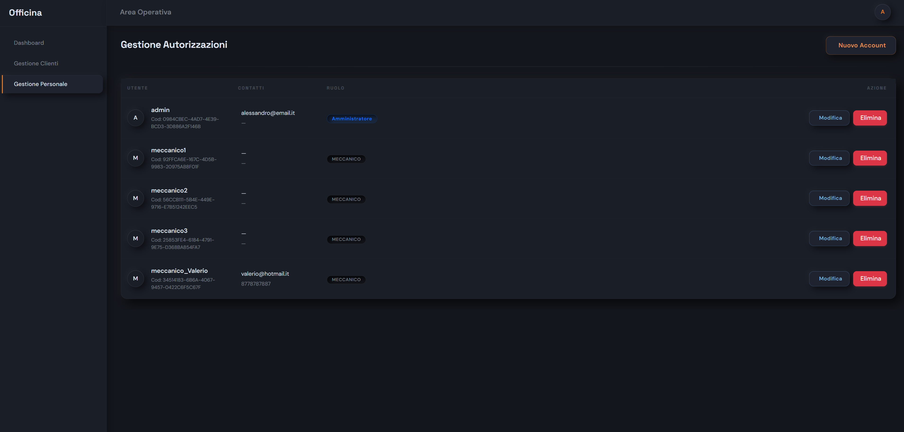
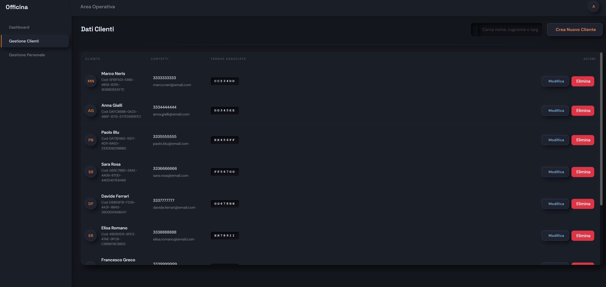
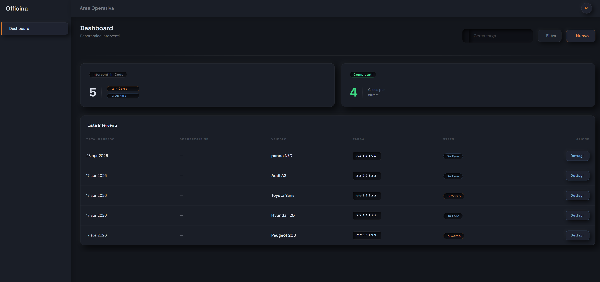

# C# & .NET — Portfolio di Sviluppo

> Documentazione del percorso completo affrontato durante il corso **Sviluppatore C# & .NET Core** (TalentForm), culminando nel progetto gestionale full-stack **OfficinaManager** — un'applicazione client-server con frontend Blazor, backend REST e database SQL Server.


---

## Indice

- [Panoramica](#panoramica)
- [Progetto Principale: OfficinaManager](#-progetto-principale-officinamanager)
- [Percorso Didattico](#-percorso-didattico)
- [Repository Esercitazioni](#-repository-esercitazioni)
- [Obiettivi del Portfolio](#-obiettivi-del-portfolio)

---

## Panoramica

Raccolta strutturata di applicazioni, architetture e script sviluppati durante il corso. Il focus non si limita alla sintassi del linguaggio, ma esplora **pattern architetturali**, **principi di sicurezza** e **buone pratiche di sviluppo** applicate a contesti aziendali reali.

---

## 🏆 Progetto Principale: OfficinaManager

Applicazione gestionale completa per officine meccaniche, progettata con una solida architettura client-server.

### Architettura

```
OfficinaManager/
├── OfficinaManager.API/        # Backend — REST API (ASP.NET Core)
├── OfficinaManager.Client/     # Frontend — Blazor WebAssembly
└── OfficinaManager.Shared/     # Modelli e DTO condivisi
```

### Caratteristiche Tecniche

| Area | Dettaglio |
|------|-----------|
| **Architettura** | Soluzione a livelli con API REST, Client Blazor e Shared Models |
| **Database & ORM** | Code-First con Entity Framework Core su SQL Server |
| **Autenticazione** | JWT (JSON Web Token) con chiavi gestite via `appsettings.json` |
| **Autorizzazione** | RBAC con ruoli differenziati: `Amministratore` e `Meccanico` |

### Funzionalità Principali

- 🔐 **Login sicuro** con token JWT e gestione centralizzata delle policy
- 🛠️ **Gestione interventi** meccanici con storico e stato avanzamento
- 👥 **Controllo accessi** per ruolo, con risorse protette per gli amministratori
- 🗄️ **Schema relazionale** generato automaticamente dalle classi C# (Code-First)

### Galleria Interfaccia

| Login | Dashboard Admin |
|-------|-----------------|
|  |  |

| Gestione Personale | Gestione Clienti |
|--------------------|------------------|
|  |  |

| Dashboard Meccanico |
|---------------------|
|  |

---

## 📚 Percorso Didattico

| # | Modulo | Argomenti | Stato |
|---|--------|-----------|-------|
| I | **Fondamenti C#** | Logica, tipi di dato, strutture di controllo, cicli, array, metodi | ✅ Completato |
| II | **OOP** | Classi, ereditarietà, polimorfismo, interfacce, eccezioni | ✅ Completato |
| III | **Dati & File** | StreamReader/Writer, serializzazione JSON/XML, file system | ✅ Completato |
| IV | **ASP.NET Core** | MVC, API REST, Entity Framework Core, autenticazione JWT | ✅ Completato |

---

## 📁 Repository Esercitazioni

### Modulo I · Fondamenti C#
D:\ALESSIO_PERSONALE_2\Programmazione\LAV\OfficinaNew
```
📁 /Exercise/01-logic-and-data-structures/
├── AIScanner-Logic/        → Operatori logici (and, or, not) e relazionali
├── DataCleaning-Tool/      → Algoritmi di validazione e pulizia degli input
└── NetworkAnalyzer/        → Costrutti condizionali avanzati (if/else, switch)
```

---

## 🎯 Obiettivi del Portfolio

- Documentare le competenze acquisite in modo trasparente e strutturato
- Fornire esempi concreti di implementazione, dai fondamenti algoritmici alla progettazione di sistemi distribuiti
- Dimostrare la capacità di produrre codice leggibile, versionato correttamente e aderente agli standard Microsoft moderni

---

<sub>Alessio Attilia · <a href="https://www.linkedin.com/in/alessio-attilia">LinkedIn</a> · <a href="https://github.com/alessioattilia03-gif">GitHub Portfolio</a></sub>
